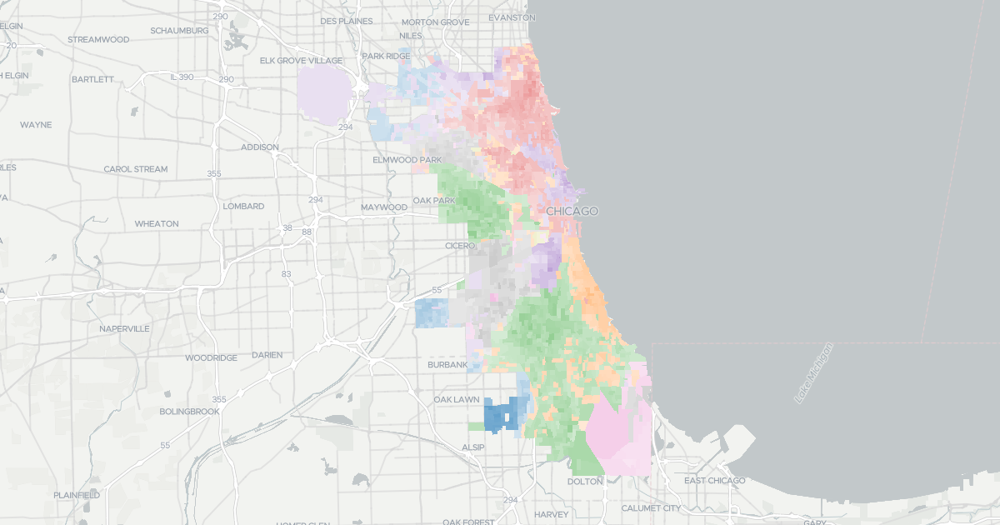

# Chicago Elections Archive

Explore precinct-level results from recent and historical Chicago elections.



## Setup

```shell
poetry install
npm install
make all
```

## Updating Data

To update data, modify the `ELECTIONS` variable in `scripts/scrape_results_metadata.py` with the ID from the [Board of Election Commissioners website](https://chicagoelections.gov/en/election-results.html), and then regenerate `input/results-metadata.json` and `output/results-metadata.json`. Then re-run `make all`, forcing execution if necessary.

Once this is done, `make build-output` can be run to GZIP all files in a separate directory that can be deployed to cloud storage with `make deploy`.

To update the displayed elections on the site, update `ELECTION_ORDER` in `site/_data/site.js`.

## Data Notes

- Missing precincts for years:
  - a few missing for 2004, 2003, 2002
  - 2000 missing a good amount
  - 1983 missing a few
